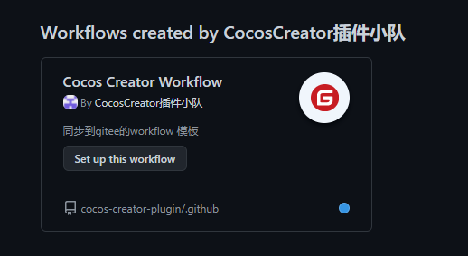
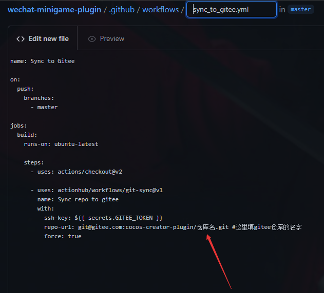

# 默认社区健康文件

参考github [文档](https://docs.github.com/cn/communities/setting-up-your-project-for-healthy-contributions/creating-a-default-community-health-file)

## 同步到gitee的 workflow模板

在自己仓库的action页创建action时，可以使用此模板来自动同步到gitee。

### 步骤

1. 在gitee上创建仓库
2. 在github的action页使用模板创建workflow，并配置指定的仓库名

